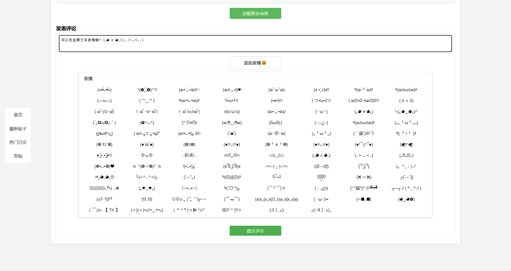

# Cloud Storage

This is my first web project that include front and back end functionality,it takes about seven days.Implement back-end functions with servlet + js + jsp.

## Content

Here are the content and features:

* Welcome page - rolling parallax,rolling optimization
* Login & SignUp & ResetPIN - `PBKDF2` encryption, Mailbox verfication, random gradient background
* Main Page - multiple file upload, display by file type
* Forum - static no backend, Emoji support
* Request filter - log filter, xss filter

## Page

Check out more screenshots in [/preview](https://github.com/Eternal-embers/cloud_storage/tree/main/preview) of the project.